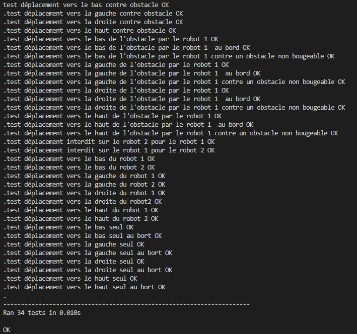
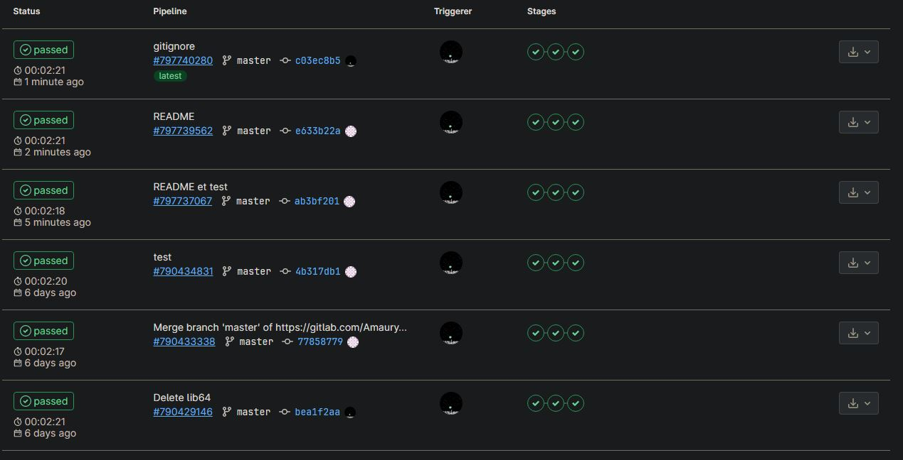

# Projet Administration Système et gestion de code - Partie 2

## I. Objectif du projet
Ce projet a pour objectif de simuler le déplecement d'un robot dans un environnement.
## II. organisation du projet
Voici l'arborescence du projet :
```
.
├── robot
│   ├──__init__.py
│   └── Map.py
├── test
│   ├──__init__.py
│   └── test_robot.py
│
├── .gitignore
├── .gitlab-ci.yml
├── README.md
├── requirements.txt
└── setup.py
```
Le projet est composé des fichiers README.md, requirements.txt (qui indique les packages à avoir), le fichier setup.py (qui renseigne les informations à fournir au package lors de l'exportation),  le fichier .gitignore (qui renseigne les fichier à ne pas archiver) et le fichier gitlab-ci.yml (qui permet le test sur gitlab et l' integration continue).
### Package robot
Dans ce pakage se situe le module robot où est codé la class Grid qui gêre les déplacements des robots par rapport à des obstacles sur une grille et permet de l'afficher. Les fonctions indiquent si elles se sont bien effectuées en renvoyant un 'True', sinon 'False'.  
Voici un exemple de fonction de déplacement :

``` python
def Up(self, num_rob):
    """
    Méthode qui permet de bouger le robot voulu vers le haut, et bouge automatiquement un obstacle déplaçable si son mouvement est autorisé.

    Args:
        num_rob (int): Numéro du robot.

    Returns:
        boolean: Indique si le déplacement est réalisable
    """
    
    add = [-1, 0]
    if self.try_rob(num_rob): # Regarde si le robot existe
        cell =[self.pos[num_rob-1][0]-1,self.pos[num_rob-1][1]]
        ret = self.isCellEmpty(cell, 'U', 'R') # Regarde si la case suivante est disponible
        if ret[0]:
            cell =[self.pos[num_rob-1][0]-1,self.pos[num_rob-1][1]]
            self.mouvObstacle(ret, cell, add)
            self.UpdatePos(num_rob, 'R', add)
            return True
    return False
```
### Package test
Dans ce package se situe le module test où sont codé les classes de test qui effectue les testes pour differentes situations de déplacements, quand les résultats sont correctes les tests poursuivent, erreur lors de l'entrée de valeurs incorrectes.  
Voici une portion du programme, en plus des tests, il y a une indication si celui-ci a été correctement réalisé. Pour cela, nous avons importer le package unittest qui réalise le test, logging qui affiche les resultats et le package à tester.
``` python
class TestMoveSeul(unittest.TestCase):
    """
    Cette classe a pour role de réaliser les tests de déplacements pour un robot seul.
    """
    def setUp(self):
        """Executed before every test case"""
        self.grille = Grid(3, 3, 1, 0, 0, [[1, 1]], [], [])
        self.log = logging.getLogger()
    
    def test_move_up(self):
        """
        Test du déplecement vers le haut.
        """
        self.assertEqual(
            self.grille.Up(1), True, "Erreur sur le déplacement"
        )
        self.log.warning("test déplacement vers le haut seul OK")
    
    def test_move_down(self):
        """
        Test du déplecement vers le bas.
        """
        self.assertEqual(
            self.grille.Down(1), True, "Erreur sur le déplacement"
        )
        self.log.warning("test déplacement vers le bas seul OK")
```
## III. Importation des packages
Pour pemettre l'importation du package, il faut faire la commande suivante qui nécessite le setup.py :
```bash
pip install .
```
## IV. Execution des Tests
Tout les tests réalisés ont été seulement fait sur les déplacements des robots par rapport à leur environneemnt et pas sur toutes les méthodes du programme car l'enssemble des méthode sont utilisées dans les tests réalisés.

  

Tout les tests sont correctes. On a bien touts les résultats attendut.
## V. Integration continue
Le projet étant enrigstrer sur Gitlab, on peut utiliser les options d'intégration continue. Cela consiste à effectuer automatiquement des actions sur le projet à chaque push du projet sur Gitlab. Dans notre cas, trois étapes sont définies à chaque push du projet sur Gitlab:  
* Analyse de la syntaxe des codes.  
* Lancement de la commande Pytest.  
* Archivage disponible au téléchargement du package robot.  

  

Le fichier .yml définit ces étapes. Les informations sur les pipeline sont disponible dans l'onglet CI/CD | Pipeline et comporte l'ensemble des diffrents pipeline du projet.